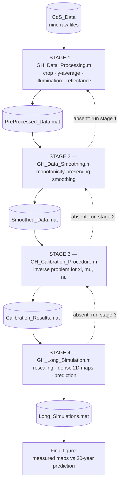

# CdS-Degradation-Modelling

## Data-informed modelling of cadmium sulfide photodegradation in oil paintings

This repository contains the complete MATLAB pipeline used to calibrate and
simulate a non-linear, non-local integrodifferential model of pigment
photooxidation, applied to the conversion of yellow cadmium sulfide (CdS)
into white cadmium sulfate (CdSO<sub>4</sub>) in oil paint.

The pipeline covers the whole path from raw measurements to prediction:
synchrotron S K-edge µ-XANES imaging data of artificially photoaged paint
mock-ups are preprocessed and averaged along the lateral direction,
regularized through a monotonicity-preserving smoothing procedure, and then
used to solve an inverse problem for the three dimensionless parameters of
the model. The calibrated model is finally integrated up to 30 years to
predict the growth of the sulfate alteration layer well before any change
becomes visible.

The underlying mathematical model is the one introduced by Ceseri, Natalini
and Pezzella [[2](#siam-paper)], based on the coupling of Beer–Lambert
light attenuation with Arrhenius chemical kinetics. The numerical treatment
uses a second-order predictor–corrector scheme built on Non-Standard Finite
Differences, which preserves positivity and monotonicity of the solution
independently of the step size. See [[1](#cds-paper)] for the full
formulation, the calibration strategy and the discussion of the results.

### Authors

* Sara Mattana, Francesca Rosi, Aldo Romani, Letizia Monico<br/>
  Institute of Chemical Science and Technologies "G. Natta" (SCITEC)<br/>
  National Research Council, Perugia, Italy<br/>
  A. Romani is also with the Department of Chemistry, Biology and
  Biotechnology, University of Perugia, Perugia, Italy
* Mario Pezzella, Roberto Natalini<br/>
  Institute for Applied Mathematics "Mauro Picone" (IAC)<br/>
  National Research Council, Naples and Rome, Italy<br/>
  M. Pezzella is also with the Department of Mathematics and Applications
  "R. Caccioppoli", University of Naples Federico II, Naples, Italy
* Marine Cotte<br/>
  European Synchrotron Radiation Facility, Grenoble, France<br/>
  and Sorbonne Université, CNRS, LAMS, Paris, France
* Costanza Miliani<br/>
  Institute of Heritage Science (ISPC)<br/>
  National Research Council, Naples, Italy

S. Mattana and M. Pezzella contributed equally to this work.
R. Natalini and L. Monico are the corresponding authors.

**Software and code developed by:** Mario Pezzella<br/>
**Version:** 1.0<br/>
**Release date:** August 2026

### Requirements

The code was developed and tested with **MATLAB R2025b**. The following
toolboxes are required:

| Toolbox | Used for |
|---|---|
| Symbolic Math Toolbox | `legendreP`, the shifted Legendre basis of the smoothing procedure |
| Curve Fitting Toolbox | `subplus`, the positive part of the illumination and absorptivity functions |
| Optimization Toolbox | `fmincon`, local refinement of both the smoothing and the calibration |
| Global Optimization Toolbox | `simulannealbnd` and `createOptimProblem`, global exploration of the parameter space |
| Parallel Computing Toolbox | *optional*, `UseParallel` in `fmincon`. Without it MATLAB issues a warning and runs serially |

To check what is installed on your machine:

```matlab
ver
license('test','Symbolic_Toolbox')
license('test','Curve_Fitting_Toolbox')
license('test','Optimization_Toolbox')
license('test','GADS_Toolbox')          % Global Optimization
license('test','Distrib_Computing_Toolbox')  % Parallel Computing
```

No other dependency is needed: everything else (`ode45`, `spline`,
`interp1`, `readmatrix`, `tiledlayout`) is part of base MATLAB.

Regarding hardware, the long-term simulation allocates a
15101 × 10951 array of doubles, about 1.3 GB, which is released as soon as
the rescaling factors are extracted from it. The post-processing then
rebuilds the dense concentration maps, which together take about 4.6 GB
and stay in memory until the end. Plan for at least 8 GB of RAM and,
if you intend to rerun the calibration, some free disk space.
### Pipeline structure

The pipeline is a chain of four stages. Each stage writes its result to a
MAT file, and each stage knows how to produce the result of the stage
before it. That single property is what lets you enter the chain wherever
you like.



Solid arrows are the forward data flow. **Dashed arrows are the fallback**:
when a stage does not find the input it needs, it runs the stage that
produces it and closes the figures that stage generated.

### How to run

Clone the repository and set MATLAB's current folder to the repository
root. Then run whichever stage produces what you want:

| You want | Run | Produces |
|---|---|---|
| Preprocessed maps and per-sample diagnostic figures | `GH_Data_Processing` | `PreProcessed_Data.mat` |
| Smoothed monotonic profiles and smoothing-error figures | `GH_Data_Smoothing` | `Smoothed_Data.mat` |
| Calibrated parameters and calibration-error figures | `GH_Calibration_Procedure` | `Calibration_Results.mat` |
| The 30-year prediction and the final figure | `GH_Long_Simulation` | `Long_Simulations.mat` |

You never need to run the stages in order by hand. Running the last one is
enough:

```matlab
GH_Long_Simulation
```

On a fresh clone all four MAT files are already present, so this loads
them and goes straight to the dense maps, the final figure and the
CdSO<sub>4</sub> table. It takes minutes, not hours.

Delete a MAT file and the fallback takes over. On an empty directory it
resolves as follows: the script looks for `Calibration_Results.mat`, does
not find it, and runs stage 3; stage 3 looks for `Smoothed_Data.mat`, does
not find it, and runs stage 2; stage 2 looks for `PreProcessed_Data.mat`,
does not find it, and runs stage 1. Stage 1 reads the raw data and the
chain then unwinds forward, each stage completing and saving before
returning control to its caller. The console narrates every one of these
decisions, so you can always see which stages are being computed and which
are being loaded from cache.

The two solver functions are never called directly. They are invoked by
stages 3 and 4:

* `GH_Cal_CdS_PCTrap_Adim.m` — the forward solver used inside the
  calibration loop, on a 152 × 681 grid, evaluated up to 5 × 10<sup>4</sup>
  times.
* `GH_Cal_CdS_PCTrap_Adim_Denser.m` — the same model and scheme on a
  15101 × 10951 grid over 30 years, evaluated once.

Both read `Smoothed_Data.mat` themselves rather than receiving the data as
arguments, so that file must exist before any simulation can run. If it
does not, they trigger stage 2 exactly as the scripts do.

**Recomputing from scratch is long.** The calibration dominates: each of
its objective evaluations integrates the model over the whole space-time
grid. The long-term simulation then integrates the same model over a grid
one hundred times finer in space. Starting from an empty directory the
pipeline can run for many hours. This is why the caches are shipped: you
only pay that cost if you deliberately choose to.

### Caching and invalidation

The four MAT files are caches. Their presence means "this has already been
computed"; their absence means "compute it".

| File | Written by | Read by |
|---|---|---|
| `PreProcessed_Data.mat` | stage 1 | stage 2 |
| `Smoothed_Data.mat` | stage 2 | stage 3, both solvers |
| `Calibration_Results.mat` | stage 3 | stage 4 |
| `Long_Simulations.mat` | stage 4 (rescaling factors only) | stage 4 on re-run |

**All four are committed to the repository.** Together they take about
3 MB, so a fresh clone already contains the results of every stage: you
can reproduce all the figures, and the CdSO<sub>4</sub> table of Stage 4,
without rerunning the calibration or the thirty-year simulation. Each
stage writes an explicit list of variables rather than the whole
workspace, which is what keeps them small and free of machine-specific
paths. In particular `Long_Simulations.mat` holds only the ten per-sample
rescaling factors, 15101 values each: the 15101 × 10951 solution they are
derived from is never stored, and the dense experimental maps are pure
interpolation and are rebuilt at every run.

To force a stage to recompute, delete its MAT file and run it again.

**Deleting an early file does not invalidate the later ones.** This is the
one sharp edge of the design. The fallback logic only ever asks *does this
file exist*, never *is it still consistent with the file it came from*. If
you change a smoothing regularizer, delete `Smoothed_Data.mat` and rerun
stage 4, stage 4 will find `Calibration_Results.mat` sitting there from
before and use the old parameters without warning. So when you change
something, delete that stage's output **and everything downstream of it**:

| If you change | Delete |
|---|---|
| anything in `CdS_Data/` or stage 1 | all four MAT files |
| a smoothing setting in stage 2 | `Smoothed_Data.mat`, `Calibration_Results.mat`, `Long_Simulations.mat` |
| weights or bounds in stage 3 | `Calibration_Results.mat`, `Long_Simulations.mat` |
| resolution or horizon in the dense solver | `Long_Simulations.mat` |

One convenience, from the repository root:

```matlab
delete Smoothed_Data.mat Calibration_Results.mat Long_Simulations.mat
```

### A note on `clear`

The pipeline scripts deliberately avoid `clear all`, and you should avoid
it too while a run is in progress.

Because the stages invoke one another through `run`, they all execute in
the **same workspace**. A nested script that clears the workspace destroys
variables its caller still needs, and the resulting failures surface far
from their cause: in earlier testing this appeared as `fmincon` reporting
*"Supplied objective function must return a scalar value"* during a
calibration run that had triggered the smoothing stage — an error with no
visible connection to the actual problem.

### Samples and notation

Five photoaged mock-ups were analysed by µ-XANES imaging. Throughout the
code each is referred to by the identifier of its XANES map rather than by
its sample name, so this correspondence is the key to reading the
variables:

| Sample | Map ID | Exposure | Temporal weight η | Spatial decay β |
|---|---|---|---|---|
| t1 | C2 | 24 h | 0.50 | 2.50 · 10<sup>-3</sup> |
| t4 | C1 | 80 h | 1.00 | 2.50 · 10<sup>-1</sup> |
| t7 | D1 | 167 h | 1.75 | 1.50 · 10<sup>-1</sup> |
| t9 | B2 | 340 h | 1.00 | 1.25 · 10<sup>-1</sup> |
| t10 | B1 | 680 h | 3.00 | 2.50 · 10<sup>-3</sup> |

A variable named `CdSD1_crop`, `Adim_B2_mean` or `fitted_value_B1` thus
refers to sample t7, t9 and t10 respectively. The weights entering the loss
function are documented in `docs/pipeline.md`.

### Software content

* `GH_Data_Processing.m`<br/>
  First step of the pipeline. Reads the five µ-XANES concentration maps,
  reshapes them, crops each to its deepest common positive region, and
  computes the y-averaged depth profiles with their standard deviations.
  Also builds the dimensionless illumination profile by truncating the
  three lamp spectra at the CdS band-gap wavelength and averaging them,
  reads the UV-Vis reflectance, and defines the water-profile parameters.
  Produces `PreProcessed_Data.mat`, an overview figure of the five raw
  maps, and one figure per sample.
* `GH_Data_Smoothing.m`<br/>
  Second step. Truncates all profiles to the maximum common depth, builds
  the dimensionless depth coordinate, and applies the
  monotonicity-preserving smoothing: each profile is represented through
  the solution of the second-order Cauchy problem *f''(z) = g(z) f'(z)*,
  with *g* expanded on a regularized shifted Legendre basis whose
  coefficients are fitted by `fmincon`. Produces `Smoothed_Data.mat`,
  a comparison of raw and smoothed profiles, and a figure comparing the
  smoothing error with the standard deviation of the data.
* `GH_Calibration_Procedure.m`<br/>
  Third step. Solves the inverse problem for the dimensionless parameters
  ξ, μ and ν by minimizing a weighted relative squared error over the five
  sampling times, combining global simulated annealing with a local
  interior-point refinement. Produces `Calibration_Results.mat` and the
  calibration error figure, which reports the absolute error against both
  the smoothed profiles used for calibration and the original y-averaged
  data, together with the 5% instrumental sensitivity threshold.
* `GH_Cal_CdS_PCTrap_Adim.m`<br/>
  Forward solver used inside the calibration loop. Integrates the
  dimensionless model on a 152 × 681 grid with a predictor–corrector
  scheme based on the trapezoidal rule, in the exponential form that
  preserves positivity, and returns the five concentration profiles at the
  experimental sampling times.
* `GH_Cal_CdS_PCTrap_Adim_Denser.m`<br/>
  Same model and same scheme, with a hundredfold finer spatial resolution
  and the reference time set to 30 years, so that consecutive columns are
  one day apart. Returns the complete space-time solution and its
  dimensionless time grid.
* `GH_Long_Simulation.m`<br/>
  Final step. Runs the long-term simulation with the calibrated
  parameters, rescales the dimensionless solution separately for each
  sample so that it matches the concentration observed at that sample's
  measurement time, reconstructs dense two-dimensional maps by spline
  interpolation along y and z, and produces the figure comparing the
  measured maps with the predicted concentrations after 30 years. It also
  prints the CdSO<sub>4</sub> summary table: degradation-front position at
  one and 30 years, mean CdSO<sub>4</sub> concentration above the front,
  and percentage increase of the total content. These are the values of
  Table 2 of the manuscript.
* `CdS_Data/`<br/>
  The nine raw experimental files, together with a `README.md` documenting
  their format, their column layout and their provenance. These are the
  only inputs to the pipeline.
* `docs/pipeline.md`<br/>
  Extended description of the pipeline: model equations, dimensionless
  groups, discretization, the smoothing procedure, the loss function and
  its weights, and the rescaling that turns the dimensionless solution
  into a per-sample prediction.

### Data availability

The datasets generated in this study are deposited in public repositories:

* S K-edge XANES data — ESRF-ICAT:
  [doi.esrf.fr/10.15151/ESRF-DC-2491544156](https://doi.esrf.fr/10.15151/ESRF-DC-2491544156)
* External reflection FTIR and VIS spectroscopy data — Zenodo:
  [10.5281/zenodo.21652776](https://doi.org/10.5281/zenodo.21652776)

The files under `CdS_Data/` are the working subset required to reproduce
the results of [[1](#cds-paper)].

### References

1. <a name="cds-paper"></a>___Early detection and long-term prediction of pigment
   degradation in paintings through data-informed mathematical modelling___<br/>
   S. Mattana, M. Pezzella, F. Rosi, M. Cotte, A. Romani, C. Miliani,
   R. Natalini, L. Monico<br/>
   (2026), submitted.
2. <a name="siam-paper"></a>___An Integro-Differential Model of Cadmium Yellow
   Photodegradation___<br/>
   M. Ceseri, R. Natalini, M. Pezzella<br/>
   SIAM Journal on Applied Mathematics, 2025, 85(6): 2591–2610.<br/>
   [DOI: 10.1137/24M1709704](https://doi.org/10.1137/24M1709704)

### Citation

If you use this software, please cite the paper
[[1](https://github.com/MarioPezzella/CdS-Degradation-Modelling#references)] or,
better, please check there if a final version has been published. Please
cite this repository as well; a `CITATION.cff` file is provided, so the
"Cite this repository" button on the GitHub page produces a ready-made
entry in BibTeX or APA format.

### License

CdS-Degradation-Modelling is distributed under the terms of the GNU GPL
v. 3 license (see the attached `LICENSE.md` file).

### Acknowledgements

The research was financially supported by the following EU–NextGenerationEU/MUR
projects: CHANGES (Cultural Heritage Active Innovation for Next-Gen
Sustainable Society; CUP B53C22003890006), NRRP Mission 4 Component 2
Investment 1.3, project code PE0000020; H2IOSC (Humanities and cultural
Heritage Italian Open Science Cloud), NRRP Mission 4 Component 2
Investment 3.1, project code IR0000029. For the beamtime granted the
authors thank the beamline ESRF-ID21 (experiment no. HG-227). The support
by E-RIHS.it, Italian national node of the European Research
Infrastructure for Heritage Science (MUR FOE ERIHS IT 2024), is also
acknowledged.

This research is the final part of a project initiated a few years ago with
Maurizio Ceseri, who contributed significantly to its earlier stages before
his untimely passing. This work is dedicated to his memory.
