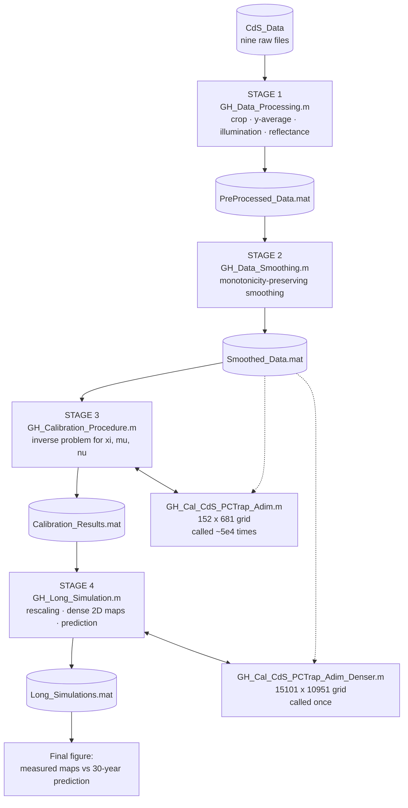

# The computational pipeline

This document describes what each stage of the pipeline does and why, at a
level of detail intended for someone who wants to modify the code rather
than just run it. For the mathematical derivation of the model see
Ceseri, Natalini and Pezzella, *SIAM J. Appl. Math.* 85(6):2591–2610,
[10.1137/24M1709704](https://doi.org/10.1137/24M1709704); for the
calibration strategy and the discussion of results see the associated
manuscript, Sections S3.2 and S3.3 of the Supporting Information.

## Overview



Solid arrows are the forward data flow. The dashed arrows record that both
solvers read the smoothed data themselves rather than receiving it as an
argument, which is why `Smoothed_Data.mat` must exist before any simulation
can run.

Each stage checks whether its own output already exists on disk. If it does,
it is loaded; if it does not, the previous stage is invoked through `run`
and its figures are closed immediately. Running the last script on an empty
directory therefore executes the whole chain in reverse discovery order and
forward computation order. See the *Pipeline structure* section of the root
`README.md` for the resolution order and the entry points.

Because the stages call one another through `run`, they execute in the
**caller's workspace**. This has one important consequence, which is why the
scripts avoid `clear all`: clearing the workspace from a nested script
destroys variables the caller still needs, and the resulting failures
surface far from their cause. In earlier testing this manifested as
`fmincon` reporting *"Supplied objective function must return a scalar
value"* during a calibration run that had triggered the smoothing step.

## The model

The degradation is described in dimensionless form on
*z* ∈ [0,1], *t* ∈ [0,1], *λ* ∈ [0,1], where *z* is depth from the exposed
surface, and *c*(*z*,*t*) is the CdS concentration relative to its initial
value:

```
c(z,t) = exp( -xi w(z) ∫₀ᵗ ∫₀¹  2 Î / (1 + β)  dλ dτ )
```

with the attenuated spectral irradiance

```
Î(λ, z, ∫₀ᶻ c) = I(λ) exp( -mu ( eps_c(λ) ∫₀ᶻ c(ζ,τ) dζ + C₀(z) eps_g(λ) ) )
```

The structure is a Beer–Lambert attenuation whose optical depth depends on
the *history* of the solution above the current point, which is what makes
the problem non-local in space and integrodifferential in time. The
exponential form makes positivity structural rather than a property to be
enforced numerically.

The three dimensionless groups are

| Parameter | Definition | Meaning |
|---|---|---|
| `xi` | (λ_M − λ_m) w<sup>ref</sup> T A exp(E_a / R T_K) | reaction rate, collecting the Arrhenius prefactor and the reference humidity and time |
| `mu` | L c<sup>ref</sup> eps_g<sup>ref</sup> | optical thickness of the layer |
| `nu` | eps_c<sup>ref</sup> / eps_g<sup>ref</sup> | ratio of CdS to CdSO<sub>4</sub> reference absorptivities |

These are the only quantities calibrated. Everything else — the
illumination spectrum, the absorptivity curves, the water profile — enters
as a fixed dimensionless input function derived from measurements.

### Fixed input functions

**Illumination.** The three lamp spectra are truncated at the CdS band-gap
wavelength (512 nm), averaged, normalized by their maximum and clipped to
non-negative values. Spectra are available for three of the five samples;
the manuscript notes that irradiance varied between experiments and that a
single representative average (ca. 1.33 × 10⁵ µW/cm²) drives the model.
That simplification enters the code at the averaging step in
`GH_Data_Processing.m`.

**Absorptivity.** Both species derive from the single UV-Vis reflectance
curve. CdS absorptivity is obtained through Beer–Lambert inversion,
`eps_c_values = -log(Refl_un)/(c_c_ref*L)`, and normalized by its maximum;
the CdSO<sub>4</sub> curve is `eps_c_values/nu`, so `nu` couples the two and
is itself calibrated. Both are evaluated on the physical wavelength window
[380, 512] nm mapped onto the dimensionless *λ* ∈ [0,1].

**Water.** The profile is linear in depth,
`w(z) = (1 - wbm/w_ref)*(1 - npsi*z)`, with the saturation vapour
concentration computed from a polynomial fit in temperature and the
reference and threshold values set by RH = 0.95 and RH_m = 0.45 at 25 °C.

## Stage 1 — preprocessing

`GH_Data_Processing.m` reshapes each µ-XANES map from its row-major listing
into a matrix whose rows are depth and columns are lateral position, then
crops it.

The cropping is the one step that deserves attention. For each lateral
column the index of the first strictly positive CdS value is located; the
maximum of those indices across all columns fixes a common starting offset,
and each column is then shifted so that all columns begin at their own
first positive value. The effect is to align the physical surface of the
paint across the map, compensating for the irregular profile of the
embedded section. The number of retained rows is the same for all columns,
so the result is still a rectangular matrix.

Depth resolution is 0.25 µm (`dx`), lateral resolution 1 µm (`dy`), both
hard-coded. The y-averaged profile and its standard deviation are then
computed column-wise, and the standard deviation is also assembled into the
closed polygon used for the shaded confidence bands in the figures.

Note that `x_crop_all`, the depth grid shared by all samples, is **not**
defined here: it depends on the shortest cropped profile among the five
samples and is therefore built in Stage 2.

## Stage 2 — monotonicity-preserving smoothing

Physically, relative CdS concentration must increase monotonically with
depth: the surface is the most degraded region. Measurement noise violates
this, and feeding non-monotonic data to the calibration would ask the model
to reproduce artefacts.

Rather than smoothing and hoping monotonicity survives, the procedure
parameterizes the space of smooth increasing positive functions directly.
Every such function is the solution of

```
f''(z) = g(z) f'(z)
```

for a suitable auxiliary function *g*, so smoothing reduces to finding *g*
instead of *f*. Here *g* is expanded on shifted Legendre polynomials on the
data interval,

```
g(z) = Σ_{m=0..M} kappa_m P_m(z)
```

and the coefficients are found by minimizing the misfit plus a
regularization term. Because the shifted Legendre polynomials are
orthogonal, the L² norm of *g* collapses to a weighted sum of squared
coefficients,

```
|| g ||²  =  z_N Σ_m kappa_m² / (2m + 1)
```

which is the `regolar*c.^2` term in `legendre_fitting`. The Cauchy problem
is integrated with `ode45` (Dormand–Prince) and the outer minimization is
performed by `fmincon` with interior-point, tolerances at 1e-14 and
parallel gradients enabled.

Initial conditions are taken from the data: *f*(z₀) is the minimum of the
profile and *f*'(z₀) the magnitude of the first finite difference.

Per-sample settings, which were tuned by inspection of the residuals
against the measured standard deviation:

| Sample | Map ID | Regularizer | Legendre terms | Manual correction |
|---|---|---|---|---|
| t1 | C2 | 0.5 · 10<sup>-4</sup> | 25 | — |
| t4 | C1 | 0.1 · 10<sup>-4</sup> | 25 | — |
| t7 | D1 | 0.1 · 10<sup>-4</sup> | 30 | `y_data(2)` rebuilt from the ratio of points 5 and 6 |
| t9 | B2 | 0.05 · 10<sup>-4</sup> | 25 | `y_data(1) = 0.85`, `y_data(2) = 0.855` |
| t10 | B1 | 3 · 10<sup>-4</sup> | 25 | — |

The two manual corrections replace the first surface points of samples t7
and t9, where the µ-XANES signal is affected by the section edge. They are
a deliberate, documented intervention on the two shallowest data points,
not a general filter.

The smoothing is validated in the second output figure, which overlays the
smoothing error with the standard deviation of the experimental data: the
former stays below the latter, so the procedure does not remove information
beyond measurement uncertainty.

## Stage 3 — calibration

The inverse problem is

```
p* = argmin  l( c(p), c* )       p = [xi, mu, nu] in Omega
```

with the weighted relative squared error

```
        Σ_i eta_i Σ_j theta_ij ( c_model(z_j, tau_i) - c*_i(z_j) )²
l(.) = -------------------------------------------------------------
        Σ_i eta_i Σ_j theta_ij ( c*_i(z_j) )²
```

Normalizing by the weighted data energy makes the loss dimensionless and
comparable across samples of different degradation extent.

**Temporal weights** `eta = [0.5, 1, 1.75, 1, 3]` reflect how much each
measurement is trusted. Sample t10 carries triple weight because its
concentration change is well above the 5% instrumental sensitivity
threshold; t7 nearly double. Sample t1 is halved because it shows CdS
concentrations slightly *higher* than t4 and t7 despite being less exposed,
an inconsistency attributed to experimental inaccuracy.

**Spatial weights** `theta_ij = i exp(-beta_i z_j)`, with *i* = 1..5 the
sampling time and *j* the depth index, concentrate the fit near the
surface, where photodegradation acts. In the code the loop variable `j`
runs over the sampling times, not over depth, so the same expression reads
`j*exp(-alpha(j)*(1:m)*0.25)` with
`alpha = [0.01, 1, 0.6, 0.5, 0.01]`; the factor 0.25 converts the depth
index into micrometres, so the published values are
`beta_i = 0.25 * alpha_i`, that is
[2.5·10⁻³, 0.25, 0.15, 0.125, 2.5·10⁻³].

**Optimization** proceeds in two stages: `simulannealbnd` explores the
admissible box globally, then its result seeds an interior-point `fmincon`
refinement. The published optimum is

```
p* = [xi*, mu*, nu*] = [3.023, 5.470, 0.764]
```

and the calibration errors stay below the 5% threshold at all depths and
all times, for both the smoothed profiles used in the fit and the original
y-averaged data.

> **Note on the bounds.** `Min_Sep` sets the upper bounds with hard-coded
> values `L = 0.003775` and `c_c_ref = 0.033365637546726`, giving
> `mu_ub = 2*L*c_c_ref*2.171393420017231e4 = 5.469969`. The published
> optimum `mu* = 5.470` therefore sits on the boundary of the admissible
> set, whereas the manuscript states an upper bound of 6. The hard-coded
> values are part of the calibration as performed and are deliberately left
> untouched; anyone repeating the calibration should be aware that this
> component is bound-constrained.

### Cost

Each objective evaluation integrates the model on a 152 × 681 grid. With
`MaxFunctionEvaluations = 5e4` for the annealing stage, this dominates the
runtime of the whole pipeline. `GH_Cal_CdS_PCTrap_Adim` reloads
`Smoothed_Data.mat` at every call, which is a known inefficiency; it can be
removed with a `persistent` cache inside the solver, without touching the
function signature, at the cost of having to run
`clear GH_Cal_CdS_PCTrap_Adim` whenever the smoothed data are regenerated
within the same session.

## The numerical scheme

Both solvers use a second-order predictor–corrector method on
Non-Standard Finite Differences. Per time step and depth level:

1. **Predictor** — a left-rectangle spectral integral and an explicit
   exponential update give a provisional `pred(j)`.
2. **Corrector** — the spectral integral is recomputed with the
   trapezoidal rule using the predictor.
3. **Update** — the same integral is evaluated on the previous time level
   and the two are averaged in the exponent:
   `C(j,n+1) = C(j,n) * exp(-W(j)*0.5*xit*(I_lambda_trap + I_lambda))`.

Keeping the update multiplicative and exponential guarantees that the
solution stays positive and non-increasing in time for any step size, which
is the property that makes the coarse grid of the calibration solver
acceptable.

Discretization:

| | Calibration solver | Long-term solver |
|---|---|---|
| `D_z` | 1/151 | 1/15100 |
| `D_t` | 3600/T (1 hour) | 86400/T (1 day) |
| `D_L` | 10<sup>-2</sup> | 10<sup>-2</sup> |
| `T` | 2 448 003 s (680 h) | 946 080 001 s (30 y) |
| grid | 152 × 681 | 15101 × 10951 |

The spatial step 1/151 is not arbitrary: it makes the numerical depth grid
coincide with the experimental one, so model and data are compared without
interpolation.

The odd reference times are also deliberate. 680 h is exactly 2 448 000 s,
which would make `1/D_t` exactly 680 and leave the last grid point exposed
to floating-point round-off — losing the t10 level, the one with the
highest temporal weight. The three extra seconds guarantee that
`0:D_t:1` contains 681 points and that the loop reaches `n = 680`. The
long-term solver uses `+1` for the same reason.

The calibration solver stores its solution at `n = 24, 80, 167, 340, 680`,
the five experimental exposures in hours. The long-term solver returns the
full space-time matrix instead, because the downstream rescaling needs
arbitrary columns.

## Stage 4 — long-term prediction

Three operations, in order.

**Dense experimental maps.** Each cropped map is spline-interpolated along
*y* by a factor `enlarge = 500`, then along *z* onto the fine grid
`z_dense`. Interpolated values are clipped at 1, since relative
concentration cannot exceed the initial one. This is purely for visual
resolution and does not affect any computed quantity.

**Per-sample rescaling.** This is the conceptual core, and the reason the
prediction is not a simple extrapolation. The long-term solution `C_LONG`
is a single dimensionless trajectory. For each sample it is renormalized by
the model's surface value at that sample's own measurement time:

```
C_30Y_norm_X = min( C_LONG(:,end) ./ C_LONG(1,k_X), 1 )
```

Columns of `C_LONG` are one day apart, so the reference columns are

| Sample | Exposure | Days | Column |
|---|---|---|---|
| t1 (C2) | 24 h | 1 | 2 |
| t4 (C1) | 80 h | 3.3 | 4 |
| t7 (D1) | 167 h | 7.0 | 8 |
| t9 (B2) | 340 h | 14.2 | 15 |
| t10 (B1) | 680 h | 28.3 | 29 |

with column 366 giving the one-year prediction and the last column
(10951, day 10950) the thirty-year one. The result is a depth-dependent
evolution factor expressing how much further each sample would degrade
from the state in which it was measured.

**Combination.** The 2D prediction multiplies the measured spatial
distribution by that factor, column by column:

```
prediction = CdSX_DS_dense_MATX .* C_30Y_norm_X(:,1)
```

So lateral structure comes from the measurement and vertical evolution from
the model. The final figure shows measured maps on the first row and
30-year predictions on the second, both on the same colour scale
`clim([0.53 1])` so the two rows are directly comparable. Coordinates are
converted from cm to µm by a factor 10⁴; concentrations are untouched.

The one-year factors `C_1Y_norm_*` do not appear in the final figure. They
feed the CdSO4 summary table printed at the end of the script, which
reports for each sample the degradation-front position at one and 30
years, the mean CdSO4 concentration between the surface and the front, and
the percentage increase of the total content. Because the rescaling factor
is constant along y, the table is computed from `mean(M,2)` and `sum(M,2)`
of each measured map rather than from the rescaled maps themselves, using
`mean_y(1-M.*v) = 1-mean_y(M).*v` and
`sum_all(1-M.*v) = numel(M)-v'*sum_y(M)`. Both identities are exact and
they avoid allocating ten further arrays the size of the dense maps.

## Reproducibility notes

* Raw data are read through paths anchored to the script location, so the
  pipeline does not depend on MATLAB's current folder.
* The four MAT files are committed, about 3 MB in total. Each stage saves
  an explicit list of variables instead of the whole workspace, so the
  caches stay small and carry no absolute paths. `Long_Simulations.mat`
  holds only the ten rescaling factors; the 15101 x 10951 solution and the
  dense maps are never stored.
* Deleting an early MAT file does not invalidate the later ones. To
  recalibrate after changing the smoothing, delete `Smoothed_Data.mat`,
  `Calibration_Results.mat` and `Long_Simulations.mat` together.
